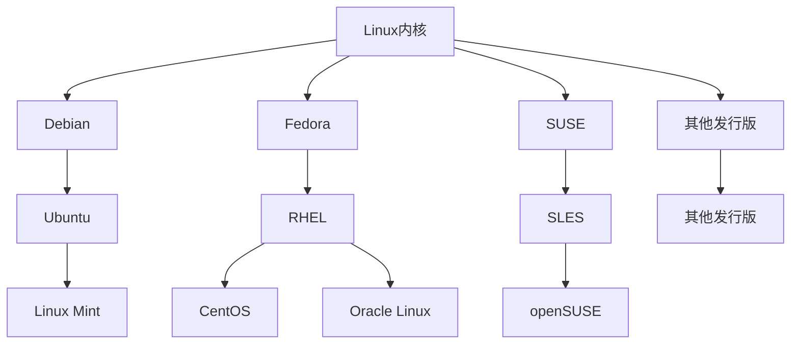

<!-- ---
home: true
title: 首页
actions:
  - text: 开始阅读
    link: /start/
    type: primary
features:
  - title: 前端
    details: JavaScript、TypeScript、HTML、Vue、React、CSS3、webpack、NodeJS等技术学习记录
  - title: 后端
    details: Java、NodeJS、Golang、MyBatis-Plus、SpringCloud、SpringBoot、Gin、Iris、Fastify、MySQL、MongoDB等设计后端技术学习记录
  - title: 其他
    details: Docker容器、Traefik反向代理、Drone CI/CD、Metrics服务指标、Vault数据管理、各个插件编写等学习记录
footer: MIT Licensed | Copyright © 2021-present longzinziyan@gmail.com
---

### 开启你的快乐之旅

 <div class="home-img">
  
  
  
</div> -->



```md
<!-- 默认情况下，这里会被保持原样 -->
1 + 2 + 3 = {{ 1 + 2 + 3 }}
```

```md:no-v-pre
<!-- 这里会被 Vue 编译 -->
1 + 2 + 3 = {{ 1 + 2 + 3 }}
```

```js:no-v-pre
// 由于 JS 代码高亮，这里不会被正确编译
const onePlusTwoPlusThree = {{ 1 + 2 + 3 }}
```
